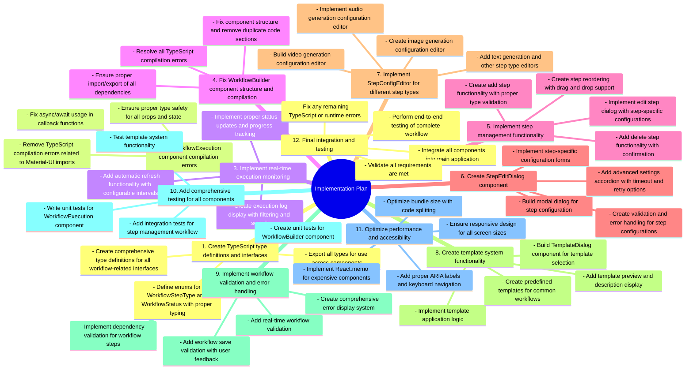

```mermaid
mindmap
  root((Implementation Plan))
    1. Create TypeScript type definitions and interfaces
      - Create comprehensive type definitions for all workflow-related interfaces
      - Define enums for WorkflowStepType and WorkflowStatus with proper typing
      - Export all types for use across components
    2. Fix WorkflowExecution component compilation errors
      - Remove TypeScript compilation errors related to Material-UI imports
      - Fix async/await usage in callback functions
      - Ensure proper type safety for all props and state
    3. Implement real-time execution monitoring
      - Add automatic refresh functionality with configurable intervals
      - Implement proper status updates and progress tracking
      - Create execution log display with filtering and search
    4. Fix WorkflowBuilder component structure and compilation
      - Resolve all TypeScript compilation errors
      - Fix component structure and remove duplicate code sections
      - Ensure proper import/export of all dependencies
    5. Implement step management functionality
      - Create add step functionality with proper type validation
      - Implement edit step dialog with step-specific configurations
      - Add delete step functionality with confirmation
      - Create step reordering with drag-and-drop support
    6. Create StepEditDialog component
      - Build modal dialog for step configuration
      - Implement step-specific configuration forms
      - Add advanced settings accordion with timeout and retry options
      - Create validation and error handling for step configurations
    7. Implement StepConfigEditor for different step types
      - Create image generation configuration editor
      - Build video generation configuration editor
      - Implement audio generation configuration editor
      - Add text generation and other step type editors
    8. Create template system functionality
      - Build TemplateDialog component for template selection
      - Implement template application logic
      - Create predefined templates for common workflows
      - Add template preview and description display
    9. Implement workflow validation and error handling
      - Add real-time workflow validation
      - Create comprehensive error display system
      - Implement dependency validation for workflow steps
      - Add workflow save validation with user feedback
    10. Add comprehensive testing for all components
      - Write unit tests for WorkflowExecution component
      - Create unit tests for WorkflowBuilder component
      - Add integration tests for step management workflow
      - Test template system functionality
    11. Optimize performance and accessibility
      - Implement React.memo for expensive components
      - Add proper ARIA labels and keyboard navigation
      - Optimize bundle size with code splitting
      - Ensure responsive design for all screen sizes
    12. Final integration and testing
      - Integrate all components into main application
      - Perform end-to-end testing of complete workflow
      - Fix any remaining TypeScript or runtime errors
      - Validate all requirements are met
```